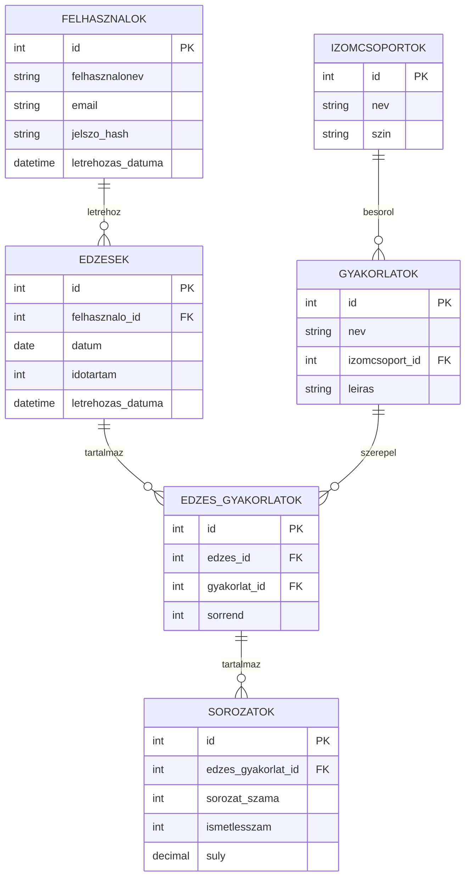

```mermaid
erDiagram
    FELHASZNALOK ||--o{ EDZESEK : "letrehoz"
    EDZESEK ||--o{ EDZES_GYAKORLATOK : "tartalmaz"
    GYAKORLATOK ||--o{ EDZES_GYAKORLATOK : "szerepel"
    IZOMCSOPORTOK ||--o{ GYAKORLATOK : "besorol"
    EDZES_GYAKORLATOK ||--o{ SOROZATOK : "tartalmaz"

    FELHASZNALOK {
        int id PK
        string felhasznalonev
        string email
        string jelszo_hash
        datetime letrehozas_datuma
    }

    EDZESEK {
        int id PK
        int felhasznalo_id FK
        date datum
        int idotartam
        datetime letrehozas_datuma
    }

    GYAKORLATOK {
        int id PK
        string nev
        int izomcsoport_id FK
        string leiras
    }

    EDZES_GYAKORLATOK {
        int id PK
        int edzes_id FK
        int gyakorlat_id FK
        int sorrend
    }

    SOROZATOK {
        int id PK
        int edzes_gyakorlat_id FK
        int sorozat_szama
        int ismetlesszam
        decimal suly
    }

    IZOMCSOPORTOK {
        int id PK
        string nev
        string szin
    }
```
