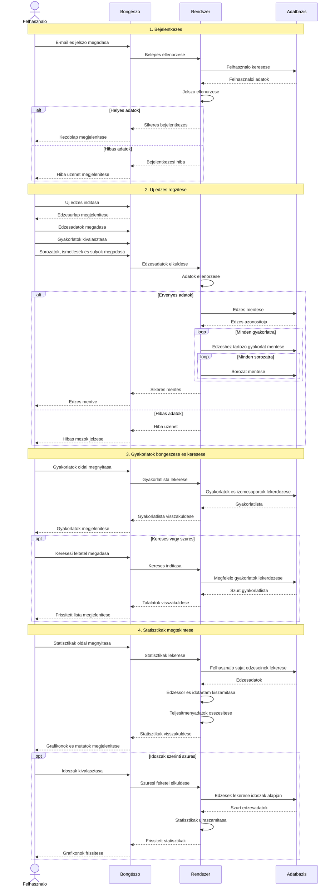

```mermaid
sequenceDiagram
    actor F as Felhasznalo
    participant B as Bongészo
    participant R as Rendszer
    participant A as Adatbazis

        Note over F,A: 1. Bejelentkezes
        F->>B: E-mail es jelszo megadasa
        B->>R: Belepes ellenorzese
        R->>A: Felhasznalo keresese
        A-->>R: Felhasznaloi adatok
        R->>R: Jelszo ellenorzese
        alt Helyes adatok
            R-->>B: Sikeres bejelentkezes
            B-->>F: Kezdolap megjelenitese
        else Hibas adatok
            R-->>B: Bejelentkezesi hiba
            B-->>F: Hiba uzenet megjelenitese
        end

        Note over F,A: 2. Uj edzes rogzitese
        F->>B: Uj edzes inditasa
        B-->>F: Edzesurlap megjelenitese
        F->>B: Edzesadatok megadasa
        F->>B: Gyakorlatok kivalasztasa
        F->>B: Sorozatok, ismetlesek es sulyok megadasa
        B->>R: Edzesadatok elkuldese
        R->>R: Adatok ellenorzese
        alt Ervenyes adatok
            R->>A: Edzes mentese
            A-->>R: Edzes azonositoja
            loop Minden gyakorlatra
                R->>A: Edzeshez tartozo gyakorlat mentese
                loop Minden sorozatra
                    R->>A: Sorozat mentese
                end
            end
            R-->>B: Sikeres mentes
            B-->>F: Edzes mentve
        else Hibas adatok
            R-->>B: Hiba uzenet
            B-->>F: Hibas mezok jelzese
        end

        Note over F,A: 3. Gyakorlatok bongeszese es keresese
        F->>B: Gyakorlatok oldal megnyitasa
        B->>R: Gyakorlatlista lekerese
        R->>A: Gyakorlatok es izomcsoportok lekerdezese
        A-->>R: Gyakorlatlista
        R-->>B: Gyakorlatlista visszakuldese
        B-->>F: Gyakorlatok megjelenitese
        opt Kereses vagy szures
            F->>B: Keresesi feltetel megadasa
            B->>R: Kereses inditasa
            R->>A: Megfelelo gyakorlatok lekerdezese
            A-->>R: Szurt gyakorlatlista
            R-->>B: Talalatok visszakuldese
            B-->>F: Frissitett lista megjelenitese
        end

        Note over F,A: 4. Statisztikak megtekintese
        F->>B: Statisztikak oldal megnyitasa
        B->>R: Statisztikak lekerese
        R->>A: Felhasznalo sajat edzeseinek lekerese
        A-->>R: Edzesadatok
        R->>R: Edzessor es idotartam kiszamitasa
        R->>R: Teljesitmenyadatok osszesitese
        R-->>B: Statisztikak visszakuldese
        B-->>F: Grafikonok es mutatok megjelenitese
        opt Idoszak szerinti szures
            F->>B: Idoszak kivalasztasa
            B->>R: Szuresi feltetel elkuldese
            R->>A: Edzesek lekerese idoszak alapjan
            A-->>R: Szurt edzesadatok
            R->>R: Statisztikak ujraszamitasa
            R-->>B: Frissitett statisztikak
            B-->>F: Grafikonok frissitese
        end
```
