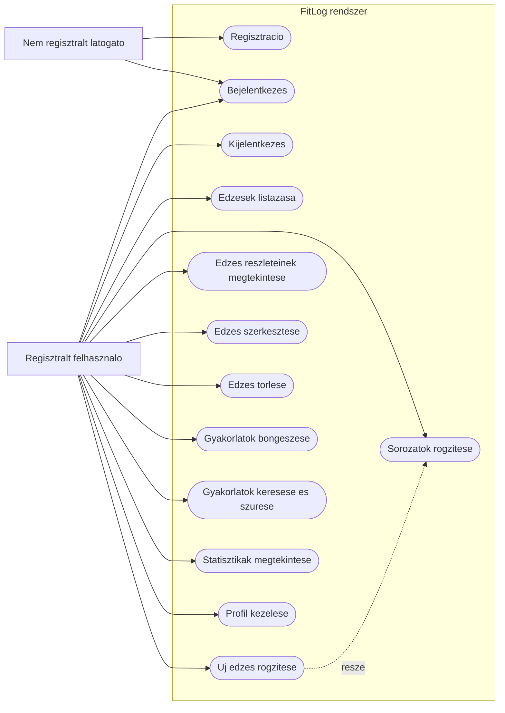

```mermaid
flowchart LR
    Latogato["Nem regisztralt latogato"]
    Felhasznalo["Regisztralt felhasznalo"]

    subgraph FitLog["FitLog rendszer"]
        UC1(["Regisztracio"])
        UC2(["Bejelentkezes"])
        UC3(["Kijelentkezes"])
        UC4(["Edzesek listazasa"])
        UC5(["Uj edzes rogzitese"])
        UC6(["Edzes reszleteinek megtekintese"])
        UC7(["Edzes szerkesztese"])
        UC8(["Edzes torlese"])
        UC9(["Gyakorlatok bongeszese"])
        UC10(["Gyakorlatok keresese es szurese"])
        UC11(["Sorozatok rogzitese"])
        UC12(["Statisztikak megtekintese"])
        UC13(["Profil kezelese"])
    end

    Latogato --> UC1
    Latogato --> UC2

    Felhasznalo --> UC2
    Felhasznalo --> UC3
    Felhasznalo --> UC4
    Felhasznalo --> UC5
    Felhasznalo --> UC6
    Felhasznalo --> UC7
    Felhasznalo --> UC8
    Felhasznalo --> UC9
    Felhasznalo --> UC10
    Felhasznalo --> UC11
    Felhasznalo --> UC12
    Felhasznalo --> UC13

    UC5 -. "resze" .-> UC11
```
